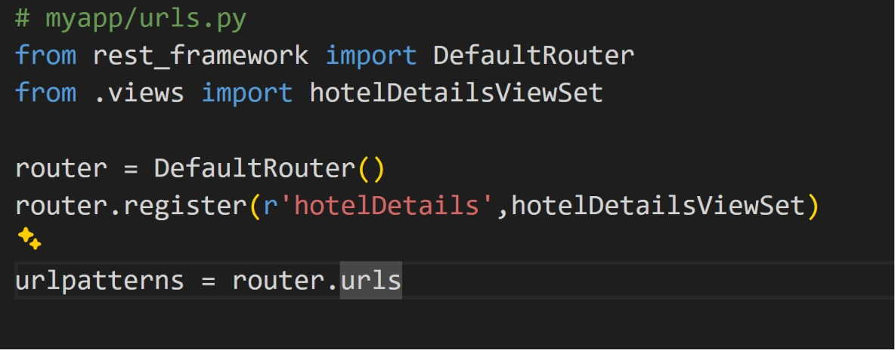

# Hotels App 🏨

A simple full-stack CRUD application for managing hotel records, built with:

- **Frontend:** Flutter
- **Backend:** Django + Django REST Framework
- **Database:** Default Django DB (SQLite unless configured otherwise)

## 📸 Screenshot



> Place your `image.png` screenshot in the same folder as this README so it renders correctly.

## ✨ Features

- View a list of all hotels (name, address, price)
- Add a new hotel
- Edit an existing hotel
- Delete a hotel
- Simple, single-screen Flutter UI backed by a REST API

## 🗂️ Project Structure

```
.
├── flutter_app/
│   ├── lib/
│   │   ├── main.dart          # UI + state management
│   │   └── api_service.dart   # REST API client
│
└── django_backend/
    └── myapp/
        ├── models.py           # hotelDetails model
        ├── serializers.py      # DRF serializer
        ├── views.py            # ModelViewSet for CRUD
        └── urls.py             # Router registration
    └── myproject/
        └── urls.py              # Root URL config
```

## 🔧 Backend Setup (Django)

1. **Create and activate a virtual environment**
   ```bash
   python -m venv venv
   source venv/bin/activate   # Windows: venv\Scripts\activate
   ```

2. **Install dependencies**
   ```bash
   pip install django djangorestframework
   ```

3. **Apply migrations**
   ```bash
   python manage.py makemigrations
   python manage.py migrate
   ```

4. **Run the server**
   ```bash
   python manage.py runserver 0.0.0.0:8000
   ```

The API will be available at:
```
http://127.0.0.1:8000/api/hotelDetails/
```

### API Endpoints

| Method | Endpoint                     | Description         |
|--------|-------------------------------|----------------------|
| GET    | `/api/hotelDetails/`          | List all hotels      |
| POST   | `/api/hotelDetails/`          | Create a new hotel    |
| GET    | `/api/hotelDetails/<id>/`     | Retrieve a hotel      |
| PUT    | `/api/hotelDetails/<id>/`     | Update a hotel        |
| DELETE | `/api/hotelDetails/<id>/`     | Delete a hotel        |

## 📱 Frontend Setup (Flutter)

1. **Install dependencies**
   ```bash
   flutter pub get
   ```

2. **Make sure the `http` package is added** in `pubspec.yaml`:
   ```yaml
   dependencies:
     flutter:
       sdk: flutter
     http: ^1.0.0
   ```

3. **Update the base URL** in `api_service.dart` if needed:
   ```dart
   static const String baseUrl = 'http://127.0.0.1:8000/api';
   ```
   - Use `http://10.0.2.2:8000/api` if running on an **Android emulator**.
   - Use your machine's local IP (e.g. `http://192.168.x.x:8000/api`) if running on a **physical device**.

4. **Run the app**
   ```bash
   flutter run
   ```

## 🧱 Data Model

```python
class hotelDetails(models.Model):
    name = models.CharField(max_length=150, blank=True, null=True)
    address = models.CharField(max_length=150, blank=True, null=True)
    price = models.DecimalField(max_digits=10, decimal_places=2, blank=True, null=True)
    created_at = models.DateTimeField(auto_now_add=True)
    updated_at = models.DateTimeField(auto_now=True)
```

## 🚀 How It Works

- The Flutter app calls `ApiService` methods (`getHotels`, `createHotel`, `updateHotel`, `deleteHotel`) to talk to the Django REST API.
- The hotel list is fetched on screen load (`initState`) and refreshed after every create/update/delete action.
- Tapping a hotel in the list loads its data into the form for editing; the delete icon removes it directly.

## 📝 Notes / Possible Improvements

- Add input validation (e.g. required fields, valid price) on both frontend and backend.
- Add loading indicators and error handling for network calls.
- Add authentication if this API is exposed beyond local development.
- Add CORS configuration (`django-cors-headers`) if the Flutter app runs on a different host/port than the Django server.

## 📄 License

This project is provided as-is for learning/demo purposes.
